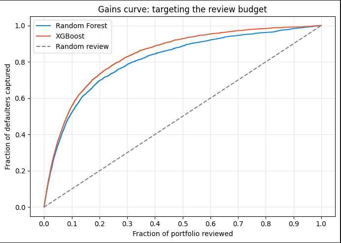
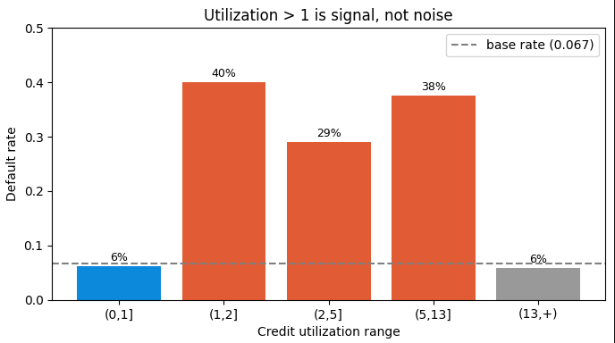
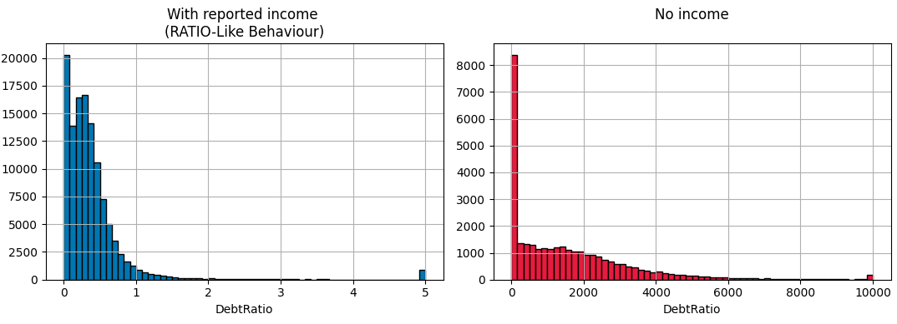

# Credit default risk — who is likely to miss their payment?

**Business question:** a lender has a limited budget for interventions (calls, reminders, credit-line review). Given payment history, which borrowers should the team contact first?

Built on 150,000 real borrowers (Give Me Some Credit, Kaggle 2011). The emphasis here is **understanding messy data before modeling it** — because on this dataset, a generic "drop the outliers" approach destroys the strongest signal.

---
## Data dictionary

| Variable | Description | Type |
|---|---|---|
| `SeriousDlqin2yrs` | **Target.** Borrower experienced 90 days past due delinquency or worse | Y/N |
| `RevolvingUtilizationOfUnsecuredLines` | Total balance on credit cards and personal lines of credit (except real estate and no-installment debt like car loans) divided by the sum of credit limits | percentage |
| `age` | Age of borrower in years | integer |
| `NumberOfTime30-59DaysPastDueNotWorse` | Number of times borrower has been 30–59 days past due but no worse in the last 2 years | integer |
| `DebtRatio` | Monthly debt payments, alimony and living costs divided by monthly gross income | percentage |
| `MonthlyIncome` | Monthly income | real |
| `NumberOfOpenCreditLinesAndLoans` | Number of open loans (installment like car loan or mortgage) and lines of credit (e.g. credit cards) | integer |
| `NumberOfTimes90DaysLate` | Number of times borrower has been 90 days or more past due | integer |
| `NumberRealEstateLoansOrLines` | Number of mortgage and real estate loans, including home equity lines of credit | integer |
| `NumberOfTime60-89DaysPastDueNotWorse` | Number of times borrower has been 60–89 days past due but no worse in the last 2 years | integer |
| `NumberOfDependents` | Number of dependents in family, excluding themselves (spouse, children, etc.) | integer |

*Source: "Give Me Some Credit", Kaggle (2011).*

**Two of this turned out to be an incomplete definition, see findings below**

## The headline for a lender



**Reviewing the riskiest 10% of the portfolio captures ~55% of all defaulters** — 5.5 times better than reviewing at random. Business decision.

---

## Why the data work is the point

Every cleaning decision was made by measuring the **default rate of a given subset of data against the 6.7% base rate**, and asking: *what mechanism produces this number?* Rare is not the same as wrong, i.e. annomalies with signal should not be errased from data.

### Finding 1 — Credit utilization above 1 is signal, not error



Borrowers can exceed their limit via some mechanisms including the bank cutting their credit line (common in 2008–09, the period behind this data). Those are signals — utilization 1–2 defaults at **40%**, 6 times base. But above ~13 the rate falls *below* base: that's genuine data corruption (a value of 50,708 can only come from a near-zero denominator). **Don't drop.**

### Finding 2 — `DebtRatio` is two different variables in one column



83.7% of the values above 1 belong to rows with **no reported income**. When income is missing, the column might display the raw debt *amount in dollars*, not a ratio (median $907 — nonsense as a ratio, normal as a monthly payment). Mixing them would be a mistake, so the amount is split into its own column.

### Finding 3 — The values 96 and 98 might be codes, not counts

All three delinquency columns share exactly the same 269 rows with 96/98. The distribution runs 0,1,2 … 17, then nothing between 18 and 95, then a spike — impossible as a real count in a 2-year window. **But those rows default at 54.6%, eight times base.** The value is garbage; the marker is signal. So the value is replaced with each column's real maximum and a flag preserves the marker.

### Finding 4 — Missingness itself is predictive

Borrowers who don't report income default *less* (5.6% vs 6.9%). Missing values are imputed **and** flagged, preserving information that plain imputation would erase.

**No rows were dropped.** A bad cell doesn't justify discarding all the other good ones.

---

## Modeling

Stratified 70/30 split. Imputation lives **inside a `Pipeline`** so medians are learned from the training set only — avoiding data leakage. Class weights (`class_weight="balanced"` / `scale_pos_weight`) handle the 6.7% imbalance. Accuracy is not used.

| Model | ROC-AUC | PR-AUC |
|---|---|---|
| Random Forest | 0.839 | 0.350 |
| **XGBoost** | **0.866** | **0.401** |
| *no-skill baseline* | *0.500* | *0.067* |

PR-AUC of 0.40 against a 0.067 floor is **6 times better than chance**. XGBoost's performance is modestly better than Random Forest — Very similar performance by two distinct models, consistent.

### The threshold is a business decision

The default 0.5 cutoff makes any model look weak on a rare-event problem. The right threshold depends on the cost of a false negative (a missed defaulter) versus a false positive (a declined good customer). At an **equal review budget (~9% of the portfolio)**, each model tuned to its own probability scale:

| Model | Threshold | Recall | Precision |
|---|---|---|---|
| Random Forest | 0.20 | 47.8% | 36.5% |
| XGBoost | 0.76 | 52.2% | 39.3% |

The thresholds differ because `scale_pos_weight` shifts XGBoost's probability scale — so the two are **not** comparable at a fixed cutoff, however their performance is.

---

## What I'd do next

- **Rank by expected loss, not probability:** the correct banking policy for me orders borrowers by potentially-lost-money, not by probability alone — a large sum justifies a lower probability threshold. This dataset has no balance/exposure field, so the framework can be described but not executed here.

---

## Repo

```
credit-default/
├── README.md
├── NOTES.md      # TO BE ADDED
├── credit.ipynb  # full analysis: EDA, cleaning, modeling
└── figures/
```

**Data:** not committed. Download from the [Kaggle competition](https://www.kaggle.com/c/GiveMeSomeCredit) or via `kagglehub`.

*Dataset: "Give Me Some Credit", Kaggle (2011).*
