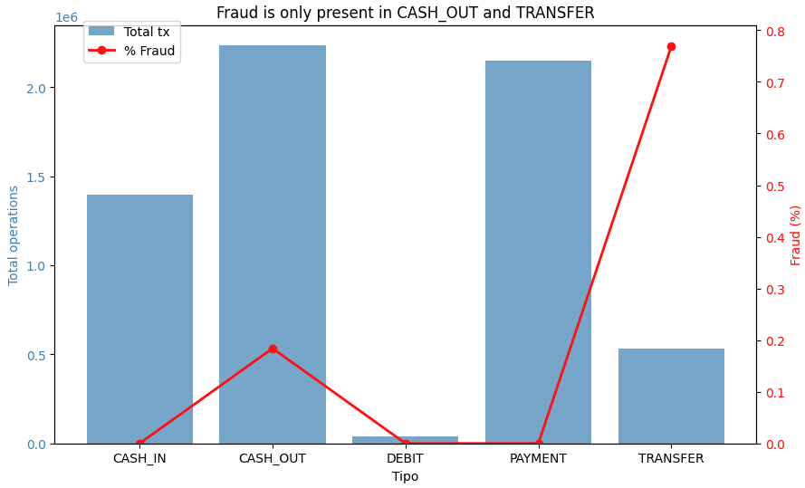
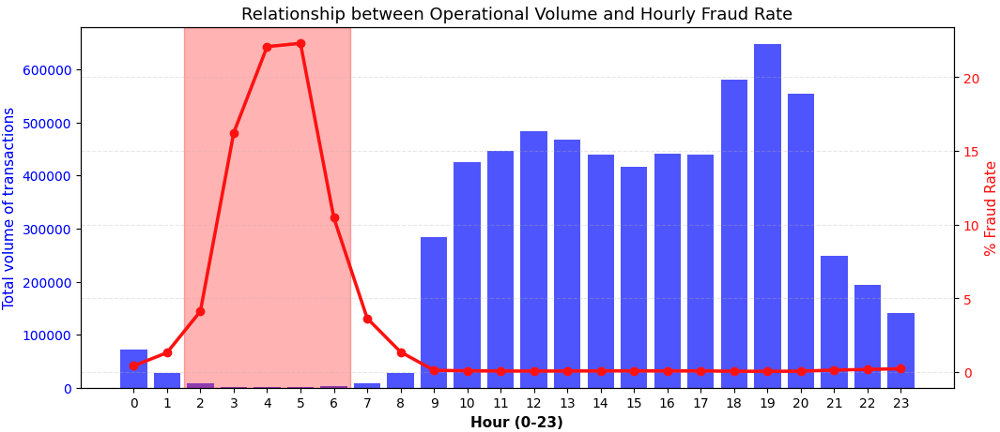
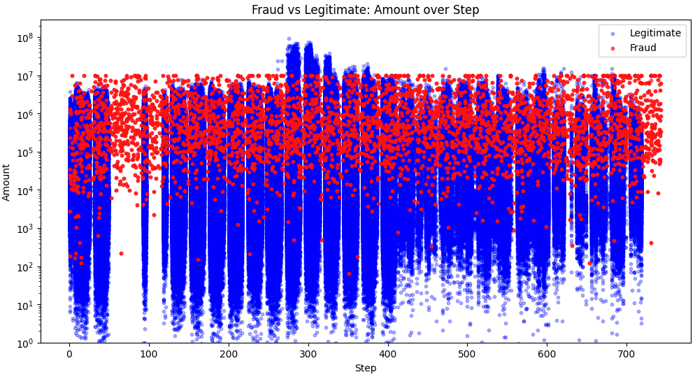
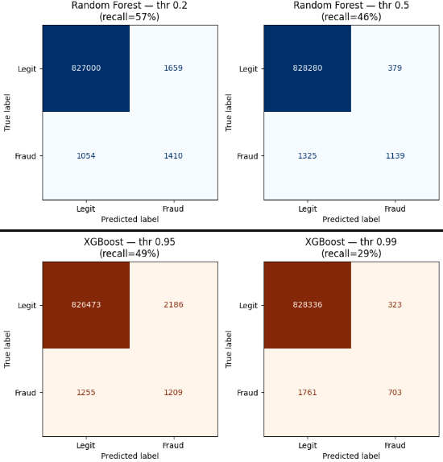

# Transactional Fraud Detection

**Business question:** How can we accurately identify fraudulent mobile-money transactions in a large dataset (6 million records), minimizing financial losses?

Built on ~6.36 million simulated mobile-money transactions (PaySim1, Kaggle). The emphasis here is **identifying behavioral patterns through SQL-based exploratory data analysis (EDA)** and **preventing target leakage** to build a robust, production-ready machine learning model. The full pipeline involved: `SQL EDA` -> `Python EDA` -> `PostgreSQL Connection` -> `Model Training & Evaluation`.

---
## Data Dictionary

| Variable | Description | Type |
|---|---|---|
| `isFraud` | **Target.** 1 if the transaction is actual fraud, 0 otherwise | integer |
| `step` | Time unit. 1 step = 1 hour. The dataset simulates ~30 days (744 steps) | integer |
| `type` | Transaction type: `CASH_IN`, `CASH_OUT`, `TRANSFER`, `PAYMENT`, `DEBIT` | string |
| `amount` | Transaction amount | float |
| `nameOrig` | Originating customer | string |
| `oldbalanceOrg` | Origin account balance before the transaction | float |
| `newbalanceOrig` | Origin account balance after the transaction | float |
| `nameDest` | Destination customer/merchant | string |
| `oldbalanceDest` | Destination account balance before the transaction | float |
| `newbalanceDest` | Destination account balance after the transaction | float |
| `isFlaggedFraud` | Simulator's internal anti-fraud flag (marks transfers > 200,000) | integer |

*Source: "PaySim1", Kaggle.*

**Note: Balance columns were strictly excluded from the final model to prevent target leakage (see findings below).**

## The Headline for the Business

**The trained model successfully captures ~80% of potentially lost-to-fraud money.** With a ROC-AUC of 0.8451 and a PR-AUC of 0.5425 on highly imbalanced data, the model efficiently separates fraudulent actions from legitimate volume. This can be increassed depending on the business ability of dealing with false positives (transactions incorrectly flagged as fraud).

---

## Why the Data Work is the Point

Every cleaning and feature engineering decision was made by querying the raw data in PostgreSQL to uncover mechanisms of fraud. Rare is not the same as wrong, but identifying data generation mechanics is key to avoiding over-optimistic models.

### Finding 1 — Fraud is highly concentrated by transaction type



Fraud is strictly present in only two transaction types: `TRANSFER` (0.77% fraud rate) and `CASH_OUT` (0.18% fraud rate). `TRANSFER` is 4 times riskier. No other type contained any fraud. 
**Action:** The dataset was filtered to train only on `TRANSFER` and `CASH_OUT` to simplify the model with zero loss of fraud examples.

### Finding 2 — A cyclical temporal pattern exposes fraud hours



While the absolute number of fraudulent transactions is roughly constant throughout the day, the *rate* of fraud spikes drastically during low-activity hours (hours 2-6, relative to the simulation start). The fraud rate surges from ~0.06% during peak hours to up to 22% during these "night" hours. 
**Action:** Engineered a new binary feature `is_night`.

### Finding 3 — Target leakage in account balances

An analysis of the balance columns (`oldbalanceOrg` - `amount` vs `newbalanceOrig`) revealed severe target leakage. For legitimate transactions, the math mostly reconciles. However, fraudulent rows show massive balance "errors" (e.g., median error of 399k vs 164k). According to PaySim documentation, balances are altered after a fraud is cancelled. 
**Action:** Excluded all balance columns from the model to prevent it from simply learning the leakage. 

### Finding 4 — The built-in rule is useless

The simulator's built-in `isFlaggedFraud` rule (which flags any `TRANSFER` > 200,000) catches almost no real fraud. This mathematically confirms the need for an advanced machine learning approach over simple heuristics.

### Finding 5 — Customers vs Merchants

Every fraudulent transaction occurs between two Customer accounts (starting with 'C'). Merchants (starting with 'M') are never the origin or destination of fraud in this dataset. Furthermore, destination "mule" accounts are virtually single-use. 

### Finding 6 — Amount vs Step has signal

 

 Consistent with Finding 2, fraud transactions distributions tend to be pretty stochastic in the step dimension, however in amount, they are mostly bounded [10^4-10^7].

---

## Feature Engineering & Model Training

Based on the EDA, the final feature set was intentionally kept small, robust, and LEAKAGE-FREE:
- `amount` (strong legitimate signal)
- `type` (TRANSFER or CASH_OUT)
- `step`
- `hour_of_day` (extracted as `step % 24`)
- `is_night` (flag for hours 2-6)

### Model Training Strategy
Because the dataset is heavily imbalanced (fraud represents < 0.2% of transactions), standard accuracy is misleading. The model was trained and evaluating **PR-AUC (Precision-Recall Area Under Curve)** over ROC-AUC, as PR-AUC is more sensitive to improvements in the minority (fraud) class. 

### Threshold Tuning & Business Impact
A standard machine learning classification threshold (0.5) is rarely optimal for real-world fraud detection. By evaluating the model's probabilities, we can adjust the decision threshold to align with the business's risk tolerance:

- **High Threshold (Conservative):** Prioritizes Precision. Catches less fraud, but ensures almost no legitimate customers are blocked (low false positives).
- **Optimized Threshold (Business-driven):** By lowering the threshold, we increase Recall, successfully capturing **~80% of potentially lost-to-fraud money**. The trade-off is an increase in false positives (legitimate transactions flagged as fraud), which would need to be handled via friction (e.g., 2FA prompts) or manual review queues.

**Confusion Matrices: Default vs. Business-Tuned Threshold**

*(Below, you can see how adjusting the threshold impacts the raw number of caught fraud vs. false alerts for the two ML models evaluated: RF vs XGBoost)*



**Performance Highlights:**
**Business Favored Model recomendation: Random Forest with 0.3-0.1 threshold**
- **ROC-AUC:** 0.8451
- **PR-AUC:** 0.5425
- **Money saved:** 80%-84.3%
---

## Repo

```
fraud-detection/
├── README.md
├── .gitignore
├── fraud_detection_eda_and_fe.sql  # PostgreSQL EDA and Feature Engineering
├── Fraud_detection.ipynb           # Python EDA, DB connection, Modeling
└── figures/                        
```

**Data:** Not committed due to size limits. Download from the [Kaggle competition](https://www.kaggle.com/datasets/ealaxi/paysim1) or via `kagglehub`. Cite: E. A. Lopez-Rojas , A. Elmir, and S. Axelsson. "PaySim: A financial mobile money simulator for fraud detection". In: The 28th European Modeling and Simulation Symposium-EMSS, Larnaca, Cyprus. 2016

## Requirements
- Python 3.8+
- pandas, numpy, scikit-learn, xgboost, matplotlib, seaborn, psycopg2