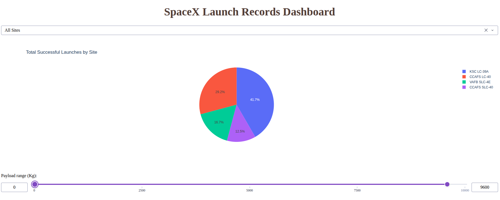
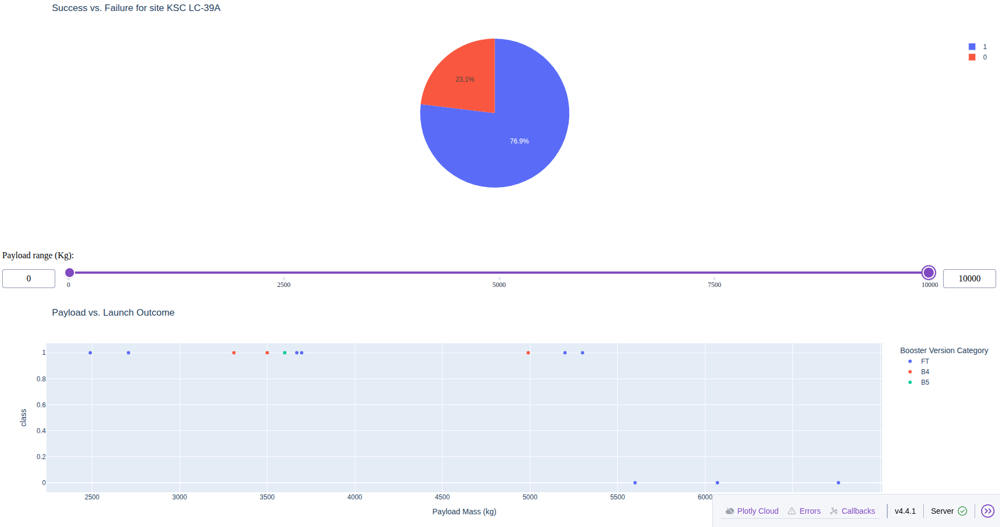

# SpaceX Falcon 9 Landing Prediction — IBM Data Science Capstone

> ### ⚠️ This is IBM coursework, not an original project
> These notebooks are the guided lab exercises from the **IBM Data Science Professional
> Certificate** (Coursera) capstone. The problem statement, notebook scaffolding, and
> starter templates were created by **IBM**; the original authors are credited at the
> bottom of each notebook. **What is mine is the work of solving the exercises** — the
> the code completions, the analysis, and the answers.
>
> My original, from-scratch work lives in the **[credit-default](../credit-default)**
> project. This folder is here to document that I completed the certification and to show
> the range of tools involved.

---

> **Skills demonstrated**:  
> `Python` · `Pandas` · `NumPy` · `Scikit-learn` · `SQL` · `BeautifulSoup` · `Requests` · `Matplotlib` · `Seaborn` · `Folium` · `Plotly Dash` · `GridSearchCV` · `One-Hot Encoding` · `Feature Engineering` · `Classification` · `Web Scraping` · `REST APIs` · `Interactive Dashboards`

## The problem (and its business angle)

At the time of notebook creation, SpaceX advertises Falcon 9 launches at about **$62M**, while other providers charge upward
of **$165M** — the difference is that SpaceX **reuses the first stage** rather than
discarding it. So predicting whether the first stage will land successfully is, in effect,
**predicting costs**. That is the target of this project: a **binary
classification** (lands / doesn't) from features like payload mass, orbit, launch site, and
booster version.

## Notebooks (in order)

Each maps to a stage of the end-to-end workflow. Original IBM authors are credited inside
each notebook; I completed the exercises.

| # | Notebook | What I did |
|---|---|---|
| 1 | `jupyter-labs-spacex-data-collection-api.ipynb` | Collected launch data from the SpaceX REST API |
| 2 | `jupyter-labs-webscraping.ipynb` | Scraped launch records from Wikipedia (BeautifulSoup) |
| 3 | `labs-jupyter-spacex-Data_wrangling.ipynb` | Cleaned data and engineered the landing-outcome label |
| 4 | `jupyter-labs-eda-sql-coursera_sqllite.ipynb` | EDA with SQL queries |
| 5 | `edadataviz.ipynb` | EDA with Matplotlib / Seaborn visualizations:  catplots, bar charts, line plots to explore relationships between flight number, payload mass, orbit, launch site, and success rate.|
| 6 | `lab_jupyter_launch_site_location.ipynb` | Interactive launch-site map with Folium |
| 7 | `SpaceX_Machine_Learning_Prediction_Part_5.ipynb` | Classification pipeline: StandardScaler, train_test_split, GridSearchCV with 10-fold CV for LogReg, SVM, Decision Tree, KNN; evaluated with confusion matrices.|

Plus the interactive dashboard: **`spacex_dash_app.py`** (Plotly Dash — dropdown, pie chart,
payload range slider, and payload-vs-outcome scatter).

## Results

Best classifier: **[fill in model]**, **[fill in]% accuracy** on the test set. The strongest
predictors of a successful landing were payload mass, orbit type, and the booster's number of
previous flights.

| Model | Accuracy (Cross-Validation) | Accuracy (Test) |
|---|---|---|
| Log-reg | 84.6% | 83.3% |
| SVM | 84.8% | 83.3% |
| **Decision Tree** | **87.6%** | **83.3%** |
| KNN | 84.8% | 83.3% |

Decision won in cross-validation, however every method did the same for the test set (only 18 rows) so not enough data to come to a good conclusion. This suggest two things: 1) Collect a bigger sample of data 2) In the absence of a large-enough dataset, simple classification algorithms perform (at least in this example) as good as more sophisticated models. 

## Running the dashboard

```bash
pip install pandas dash plotly
wget "https://cf-courses-data.s3.us.cloud-object-storage.appdomain.cloud/IBM-DS0321EN-SkillsNetwork/datasets/spacex_launch_dash.csv"
python spacex_dash_app.py     # abre http://127.0.0.1:8050
```
Dashboard allows filtering by Launch Site and payload range in kg, showing the relationtip between these and a succesful landing.





## Key takeaways

- **Data collection**: Combined REST API and web scraping to build a unified dataset.
- **Data wrangling**: Engineered a binary target from messy landing outcomes; handled missing values.
- **EDA**: Identified that payload mass, orbit type, and booster reuse count are strong predictors of landing success.
- **Feature engineering**: Applied one-hot encoding to categorical variables (Orbit, Launch Site, Landing Pad, Serial).
- **Modeling**: Used GridSearchCV to optimize hyperparameters; found that Decision Tree performed best in cross-validation.
- **Limitation**: The small dataset (90 launches) limits results – a larger dataset would allow more fine-tunned model comparisson.
- **Dashboard**: Built an interactive Plotly Dash app to filter by launch site and payload range, showing success/failure patterns.

## Presentation

Capstone summary (PDF): **[In progress]**

---

*Course: IBM Data Science Professional Certificate (Coursera). Data: SpaceX public REST API
and Wikipedia. Original lab authors are credited within each notebook.*
